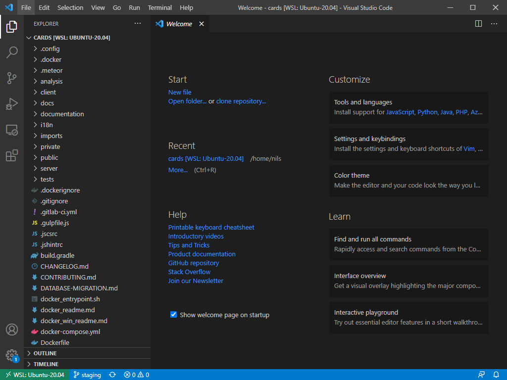

arsnova🍅cards - Installing Docker under Windows via WSL 2
---

arsnova🍅cards will never run as efficiently under Windows as under Linux. If you still want to use Windows, use the following method to get the best performance out of Docker for Windows.

You get the best results when you use Docker with the WSL 2 engine. Not Hyper-V, not Virtualbox and not Windows Containers. If you use a method other than WSL 2 you will experience serious performance problems.

Hint: the official installation guide for **Windows Subsystem for Linux** (WSL) can be found here: [https://docs.microsoft.com/en-us/windows/wsl/install-win10](https://docs.microsoft.com/en-us/windows/wsl/install-win10).

## Prerequisites

You need Windows 10. Older operating systems are not supported. If you are using an older Windows operating system, please use a virtual machine with Linux.

Supported Windows 10 Versions:
- For x64 systems: Version 1903 or higher, with Build 18362 or higher.
- For ARM64 systems: Version 2004 or higher, with Build 19041 or higher.

You must have turned on virtualization, you can check that in the task manager:


If virtualization is not activated, it may be necessary to activate the virtualization in the firmware of your computer. With Intel e.g. `Intel-VT` or with AMD `AMD-V`.

## Installing WSL 2

Enable the WSL Feature by running following command as administrator in the PowerShell:
```bash
dism.exe /online /enable-feature /featurename:Microsoft-Windows-Subsystem-Linux /all /norestart
```

Enable the Virtual Machine Platform by running following command as administrator in the PowerShell:
```bash
dism.exe /online /enable-feature /featurename:VirtualMachinePlatform /all /norestart
```

Now restart your computer.

Now you have to update wo WSL 2. Therefore download the update according to your architecture:

| arch | download |
| --- | --- |
| x64 | https://wslstorestorage.blob.core.windows.net/wslblob/wsl_update_x64.msi |
| arm64 | https://wslstorestorage.blob.core.windows.net/wslblob/wsl_update_arm64.msi |

Install the update by double clicking the downloaded file.

Now set the WSL 2 as default for new Images by running following command as administrator in the PowerShell:

```bash
wsl --set-default-version 2
```

## Installing a Linux Distro on WSL 2 via Microsoft Store

You can install Linux distributions from the Microsoft Store: [https://aka.ms/wslstore](https://aka.ms/wslstore).

Restart your computer after installation has finished.

## Installing a Linux Distro on WSL 2 manually

If you don't want to use the Microsoft Store, you can also install distributions manually.

We recommend Ubuntu as Linux Distribution. Download the WSL Ubuntu package according to your architecture by running following command as administrator in the PowerShell:
```bash
# fisrt, switch to your home directory
cd ~

# for x64
Invoke-WebRequest -Uri https://aka.ms/wslubuntu2004 -OutFile Ubuntu.appx -UseBasicParsing

# for amd64
Invoke-WebRequest -Uri https://aka.ms/wslubuntu2004arm -OutFile Ubuntu.appx -UseBasicParsing
```

When the download is finished, install the Distro by running following command as administrator in the PowerShell:
```
Add-AppxPackage .\Ubuntu.appx
```

Restart your computer after installation has finished.

## Check and update your WSL 2 Distro

Now it's time to start your Linux Distro! If you have Ubuntu installed, just start the `Ubuntu` App from your start menu.

First time you start the Distro, you will be asked for a username and a password. Just take them as you like.

Stop here. After starting your Distro, it will now appear in the list of wsl images. Check that your Distro is really running with WSL 2 by running following command as administrator in the PowerShell:

```bash
wsl -l -v
```

Under `Version` it must say `2` for your Distro. If it says `1` you have to convert it by running following command as administrator in the PowerShell:
```bash
# wsl --set-version <distro_name> <version>
wsl --set-version Ubuntu-20.04 2
```

No lets go ahead.

You now are logged in to Ubuntu. First of all, update your packages:
```bash
sudo apt update
sudo apt -y dist-upgrade
sudo apt -y autoremove
```

Shutdown your WSL by running following command as administrator in the PowerShell:
```bash
wsl --shutdown
```

Then start the Ubuntu app again.

## Install Docker Desktop

Now it is time to install Docker. Since Docker Desktop can use WSL 2 as engine, Docker Desktop is available for all Windows 10 versions - including Windows 10 Home Edition. That's good news!

Download the Docker Desktop App from Docker Hub: [https://hub.docker.com/editions/community/docker-ce-desktop-windows/](https://hub.docker.com/editions/community/docker-ce-desktop-windows/).

Start the installation process by double clicking the downloaded file. Check the option `Install required Windows components for WSL 2`:


Now start the installation - that may take a while.

After installation has finished, start the Docker Desktop App. The first start may take a while as it installs the Docker Engine in your Distro.

Your Docker Desktop is ready when it says that there are no containers running:


Go to settings and check that Docker Desktop is really using WSL 2 as engine:


The box `Use the WSL 2 based engine` should be checked. Now lets go ahead.


## Prepare for development

**IMPORTANT:** WSL 2 uses its own file system on which all files for development should be located. Otherwise, every action between the Windows and Linux file systems will have to be translated and you will experience serious performance problems.

Everything that has to do with development should be done in the Distro for reasons of performance. This also means that you should use git within the Distro and not on your Windows host system. And that in turn means that your codebase should definitely be in the distro.

## Get access to the WSL file system

In your file browser, go to `\\wsl$\`.


Here is an overview of your WSL machines. Get on your machine (e.g. `Ubuntu-20.04`). You can mount your machine as a network drive with a right click, then you will always have it in the navigation bar.

After cloning a repository all the files will be here, preferably in your home directory under `/home/<your-username>/<repository>`.


Efficient work is only possible if you store your files in this file system! You cannot work efficiently with a shared Windows volume!

## Using git

You should call all your git commands from inside the Ubuntu Distro.

To get started, create a ssh key by running

```bash
ssh-keygen -t ed25519 -C "your-email-address"
```

And add the created public key (default location: `~/.ssh/id_ed25519.pub`) to your GitLab Account. To print the public key to your console run:

```bash
# the default location
cat ~/.ssh/id_ed25519.pub
```

You may clone the repository now:
```bash
# the official repo
git clone git@git.thm.de:arsnova/cards.git
# you may of course clone your fork this way
```

## Working with WSL 2

After cloning your code base you might want to work with it.

### VS CODE

If your are using Visual Studio Code, you may install the `Remote - WSL` Plugin: [https://marketplace.visualstudio.com/items?itemName=ms-vscode-remote.remote-wsl](https://marketplace.visualstudio.com/items?itemName=ms-vscode-remote.remote-wsl).

Therefore launch VS Code Quick Open (Ctrl+P), paste the following command, and press enter:

```bash
ext install ms-vscode-remote.remote-wsl
```

Then inside your Distro, switch into your working directory (e.g. `~/cards`) and run `code .` (the period is important!).

If you launch this command the first time, it may take a while as it installs the functionality inside the Distro. Then it opens up VS Code on your Windoes host machine and you can start developing:



Alternatively, after starting .cards for the first time, you can also call up VSCode via Docker Desktop:


### Your favorite IDE

If you want to work on the code with your favorite IDE other than VS Code on your host, you have to use the network drive as described above.

## Starting arsnova🍅cards

You are all done. You may now follow the instruction from the arsnova🍅cards docker installation manual: [»here«](./docker_readme.md). It goes without saying, but all commands in the arsnova🍅cards docker installation manual must then of course be executed in the distro.
