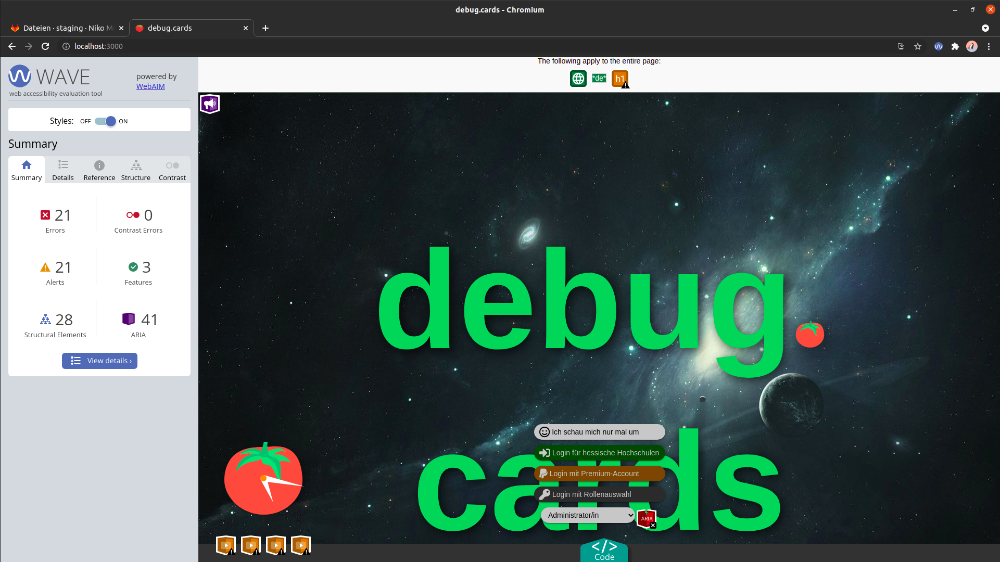
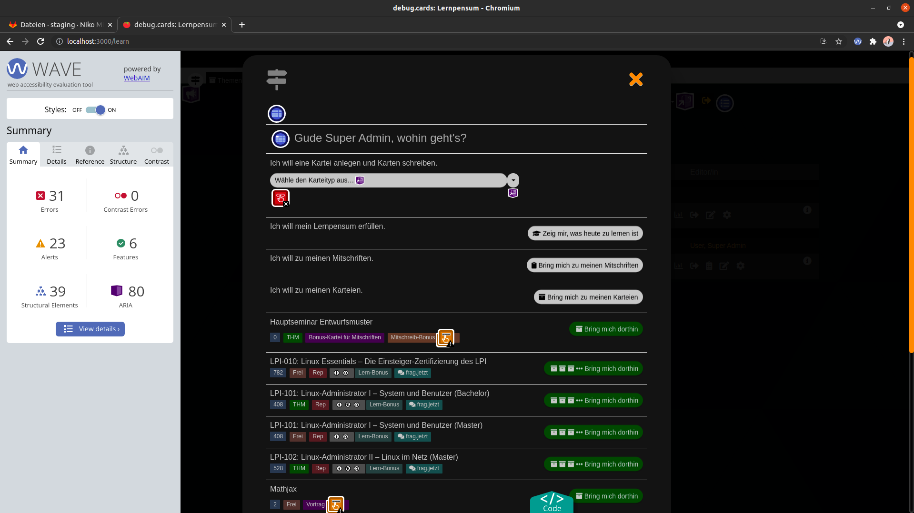
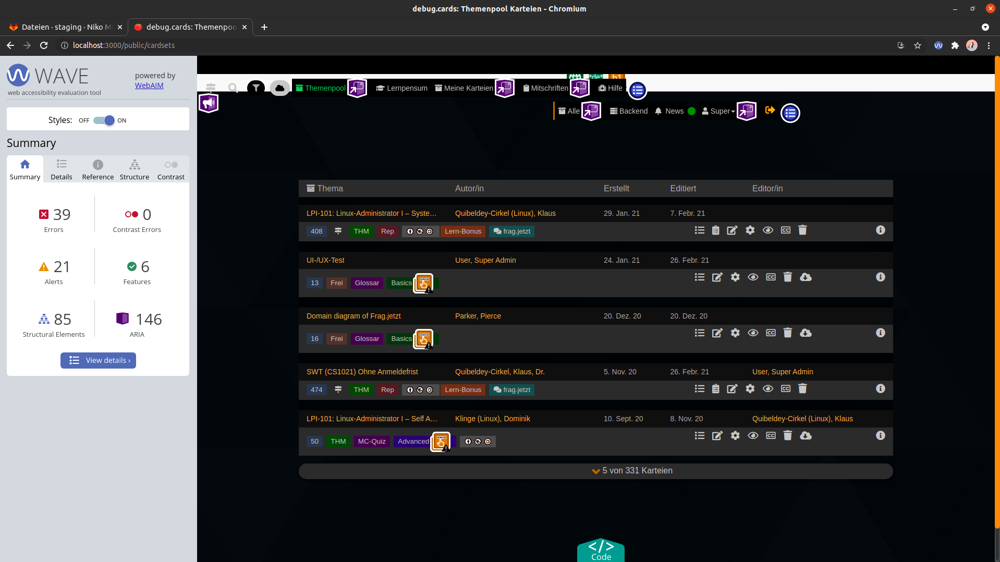
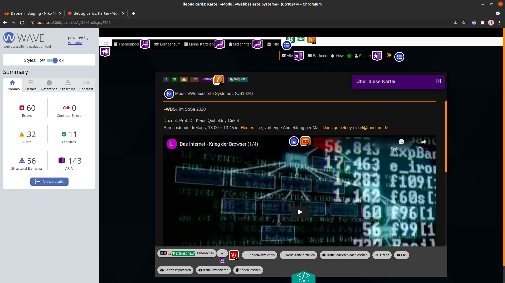

arsnova🍅cards
---
The [Progressive Web App](https://en.wikipedia.org/wiki/Progressive_web_app) arsnova🍅cards offers students a modern and intuitive access to one of the most successful and evidence based learning methods, i.e., [spaced repetition](https://en.wikipedia.org/wiki/Spaced_repetition).

arsnova🍅cards uses Meteor as application framework. For local development, you can choose the native or the containerized version with Docker.

## Screenshots Hü
> Landing Page

> Wegweiser

> Themenpool

> WBS Karte

## Hardware requirements
- 4 GB RAM

## Setup with Docker
**This is the recommended method!**

**Instructions for starting cards with Docker can be found [»here«](.docker/docker_readme.md).**

## Setup (native)

> Requirements: Node.js 12.22.21 and MongoDB 4.4.4 (If used with a separated database)

|Step | Linux Terminal Command  |
|---|---|
|1. Install [Meteor](https://www.meteor.com/)   | Refer to the link in the step column |
|2. Install git    | `sudo apt install git`  |
|3. Install python 2. Ubuntu only ships with python 3.  |`sudo apt install python`  |
|4. Install the g++ build-essential | `sudo apt install g++ build-essential` |
|5. Make sure that you've added a [SSH key](https://git.thm.de/profile/keys) | Refer to the link in the step column |
|6. Clone the remote repository  | `git clone git@git.thm.de:arsnova/cards.git` |
|7. Move inside the local repository **"cards folder"**  | `cd cards` |
|8. Install the npm package dependencies | `meteor npm install` |

### Settings (These steps are only required if you want to deploy 🍅cards on a server)
1. Add the cas id of the admins inside the admin.id array of `settings.json` (cas account)
2. Change `settings.json` according to your needs

> Warning: Never publish your settings file!

## Meteor updates
A simple update to the latest Meteor version is not always possible. Please do not update Meteor to the latest version and leave this to the owners of the repository.

## Starting the app
Use one of the following commands inside the repository (cards folder), to start your 🍅cards installation:

- For development (use this if you're going to run 🍅cards on your local device):
  - `meteor --settings settings_debug.json`
  - Access the app from your host machine by visiting http://localhost:3000

- For production:
  - `meteor --settings settings.json`

## Loading the Test Database
1. Make sure that you've installed the [MongoDB Community Tools](https://docs.mongodb.com/manual/administration/install-community/)
2. Start the server with the development settings

> Warning: The following step will delete all of your 🍅cards content

3. Open a new terminal in the cards folder and load the Test Database with: `./tests/loadTestDatabase.sh`

## Analyze code style locally
For the local analysis with docker-compose you'll need docker and docker-compose installed.
To run a local code style check with sonarqube, follow these steps:
1. switch into the analysis folder  
  `cd analysis`
2. start the sonarqube server  
  `docker-compose up -d sonarqube`
3. when sonarqube has started, you may run analysis whenever you want with  
  `docker-compose run --rm analysis`

Sonarqube will be accessible at [localhost:9000](http://localhost:9000). You find the cards project after the first successful analysis in the projects section.

## Optional features

### Authentication setup (For Google+, Facebook and Twitter logins)
1. [Create your Google+ api keys](https://console.developers.google.com/)
2. [Create your Facebook api keys](https://developers.facebook.com/)
3. [Create your Twitter api keys](https://apps.twitter.com/)

### Braintree setup (For PayPal payments)
1. [Create a Braintree sandbox account](https://www.braintreepayments.com/get-started)
2. [Login](https://sandbox.braintreegateway.com/login) to the braintree sandbox
3. Retrieve your api keys (navigate to: My User > View Authorizations)
4. Insert the keys into `settings.json`
5. Inside Braintree sandbox, navigate to Plans from left menu under `Reccuring Billing`
6. Create one plan with id "pro" and your preferred price (lowercase for Plan ID, Plan Name's should be "Pro")

### Firebase setup (For push notifications)
1. [Create a Firebase project](https://console.firebase.google.com/)
2. Get the FCM VAPID public and private key from your Firebase project (project settings > cloud messaging > Web configuration)
4. Insert the keys and a mailto: Address into your `settings.json` file:
   * Public key: `public.FCM_VAPID_PUBLIC_KEY`
   * Private key: `private.FCM_VAPID_PRIVATE_KEY`
   * mailto: Address: `private.FCM_VAPID_MAILTO_ADDRESS`

## Contribution guide
The contribution guide can be found [here](https://git.thm.de/arsnova/cards/blob/staging/CONTRIBUTING.md).

## Documentation
The documentation can be found [here](https://staging.arsnova.cards/jsdoc/).

## CI Pipeline
| Server | Status|
|--------|----------------|
|[Staging](https://staging.arsnova.cards)| |
|[Production](https://thm.cards)| |
|[Linux](https://linux.cards) ||
|SonarQube |  |

## Credits
arsnova🍅cards is powered by Technische Hochschule Mittelhessen - University of Applied Sciences.
